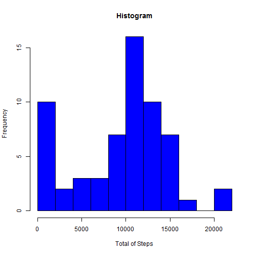
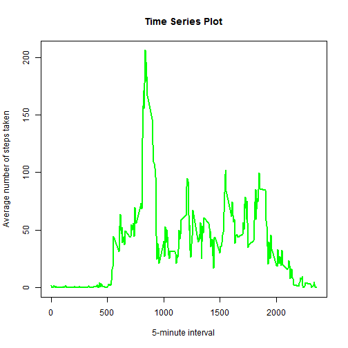
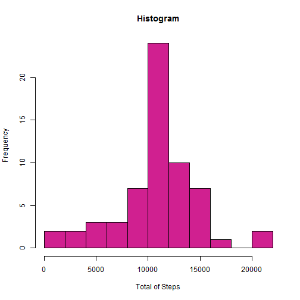
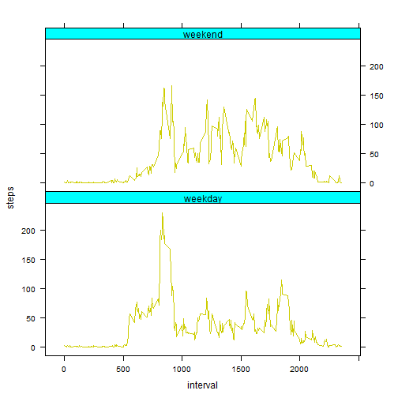

# Reproducible Research: Peer Assessment 1
## Loading and preprocessing the data
We read the data into R.

```r
actData <- read.csv("C:/Users/Sandra/R ~/activity.csv")
actData$date <- as.Date(actData$date)
```

## What is mean total number of steps taken per day?
Here is an histogram of the total number of steps taken each day. First we need to clean the data set.

```r
stepsByDay <- aggregate(actData[, 1, drop=FALSE], by=list(date = actData$date), sum, na.rm=TRUE)
hist(stepsByDay$steps, breaks=10, col="blue", main="Histogram", xlab = "Total of Steps")
```

 

To obtain the mean and the median, we can run the following code:

```r
mean1 <- mean(stepsByDay$steps, na.rm=TRUE)
median1 <- median(stepsByDay$steps, na.rm=TRUE)
```

The mean is 9354.2295 and the median is 10395.

## What is the average daily activity pattern?
In the following we have a time series plot of the 5-minute interval (x-axis) and the average number of steps taken, averaged across all days (y-axis).

```r
stepsByInterval <- aggregate(actData[, 1, drop=FALSE], by=list(interval = actData$interval), mean, na.rm=TRUE)
with(stepsByInterval, plot(interval, steps, type="l", main="Time Series Plot", xlab="5-minute interval", ylab="Average number of steps taken", col="green", lwd=2))
```

 

```r
maxInterval <- stepsByInterval$interval[which.max(stepsByInterval$steps)]
```

From this plot and the code above, we can see that the interval with the maximum number of steps is interval 835.

## Imputing missing values

```r
NAs <- sum(is.na(actData$step))
```

In our original data set we have 2304 days/intervals with missing values. To fill those in, we are going to use the mean for that 5-minute interval, but we are going to round the number so that the "steps" column continues to be of the "integer" class.

```r
actData2 <- actData
intervals <- factor(actData2[is.na(actData2$steps), 3])
levels(intervals) <- stepsByInterval[, 2]
intervals <- as.numeric(levels(intervals))[intervals]
actData2$steps[is.na(actData2$steps)] <- round(intervals)
```

If our operation was successful, then the following should output zero.

```r
sum(is.na(actData2$step))
```

```
## [1] 0
```

Now we perform the previous analysis on this new data (make an histogram of the total number of steps taken each day and calculate the mean and the median of the total number of steps taken per day).

```r
stepsByDay2 <- aggregate(actData2[, 1, drop=FALSE], by=list(date = actData2$date), sum)
hist(stepsByDay2$steps, breaks=10, col="violetred", main="Histogram", xlab = "Total of Steps")
```

 

```r
mean2 <- mean(stepsByDay2$steps)
median2 <- median(stepsByDay2$steps)
```

The mean is now 1.0766 &times; 10<sup>4</sup> and the median is 1.0762 &times; 10<sup>4</sup>. These values are both greater than the previous values we had, when we removed the NAs from the computation. These makes sense because the sums for each day went higher themselves. For example, in the original data set, the first day was entirely composed of NAs, and thus it's sum was 0, but in the new data set the sum for that day is clearly positive.

## Are there differences in activity patterns between weekdays and weekends?
Now we prepare this new data for plotting by creating a factor variable of two levels, "weekday" and "weekend".

```r
days <- weekdays(actData2$date)
days <- days %in% c("sábado", "domingo")
days <- factor(days)
levels(days) <- c("weekday", "weekend")
actData2$day <- days
stepsByInterval2 <- aggregate(actData2[, 1, drop=FALSE], by=list(day = actData2$day, interval = actData2$interval), mean)
stepsByInterval2 <- stepsByInterval2[order(stepsByInterval2$day, stepsByInterval2$interval), ]
```

Here is the panel plot of the resulting data frame from above, representing the 5-minute interval on the x-axis and the average number of steps taken, averaged across all weekday days or weekend days in the y-axis.

```r
library(lattice)
xyplot(steps ~ interval | day, data=stepsByInterval2, layout=1:2, type="l", par.settings = list(strip.background=list(col="cyan")), col.line="yellow3")
```

 
